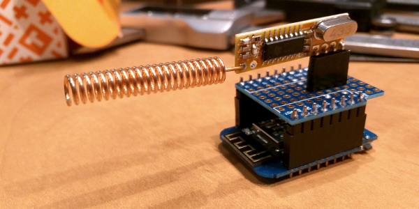

# RF 433 MHz to MQTT Gateway

Gateway to detect signals in 433MHz band and translate them to a MQTT broker.

Each signal gets its own topic within given topic root. E.g. if you leave MQTT_TOPIC as "home/rf433/" then signal 12345678 will be published to "home/rf433/12345678".

# Why?

I use this gateway to translate signals from differenet sensors around my house to a MQTT broker connected to [Home Assistant](https://home-assistant.io/) server.

# Hardware

You will need a ESP8266 board and a 433MHz receiver module.

My personal favorites are [WeMos D1 mini](https://www.aliexpress.com/wholesale?SearchText=wemos+D1+mini) and [RXB12](https://www.aliexpress.com/wholesale?SearchText=rxb12) mounted on a prototyping shield.

# Author

Paul Philippov <themactep@gmail.com>

# License

This code is released under the [WTFPL License](http://www.wtfpl.net/).

